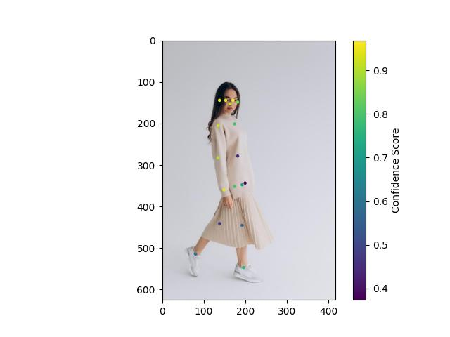

# Deploy Lite_HRNet with ONNX format

## Overview
The base model originated from .
In this project, I converted the base model to convert it into an ONNX model for cross-platform compatibility. This model can then be deployed locally from scratch, or by using Docker image.

Check section **Tasks** for more details

## Get started
### Build app from scratch
1. (Optional) Create virtual environment
    ```
    python -m venv venv
    source venv/bin/activate
    ```
1. Install dependencies for FastAPI app
    ```
    pip install -r requirements.txt
    ```
1. (Optional) Install dependencies for all files in the project
    ```
    pip install -r requirements_full.txt
    ```
1. Use `Demo.ipynb` for an interactive demo.
1. Run the app
    ```
    uvicorn main:app --reload
    ```
### Build app from Docker image
1. Pull Image from Docker Hub
    ```
    docker pull tiviluson/litehrnet_onnx:v0.3
    ```
1. Run container from the previously pulled image
    ```
    docker run -d -p 8000:8000 tiviluson/litehrnet_onnx:v0.3
    ```
### Test the app
1. Run `test.py` to test the server. Use `python -m test.py --help` for more information.
    

## Tasks
- [x] Run inference with model Lite_HRNet with MMPose's API
- [x] Rewrite the model to convert it to ONNX format
- [x] Run inference with model Lite_HRNet in ONNX format
- [x] Visualize output
- [x] Build FastAPI server to demostrate the project
- [x] Build Dockerfile for the project
- [x] Run and test Dockerfile for the project
- [x] Deploy the model using Docker and Nginx on AWS EC2
- [ ] Deploy the model using K8S

## Citation
```
@inproceedings{Yulitehrnet21,
  title={Lite-HRNet: A Lightweight High-Resolution Network},
  author={Yu, Changqian and Xiao, Bin and Gao, Changxin and Yuan, Lu and Zhang, Lei and Sang, Nong and Wang, Jingdong},
  booktitle={CVPR},
  year={2021}
}

@inproceedings{SunXLW19,
  title={Deep High-Resolution Representation Learning for Human Pose Estimation},
  author={Ke Sun and Bin Xiao and Dong Liu and Jingdong Wang},
  booktitle={CVPR},
  year={2019}
}

@article{WangSCJDZLMTWLX19,
  title={Deep High-Resolution Representation Learning for Visual Recognition},
  author={Jingdong Wang and Ke Sun and Tianheng Cheng and 
          Borui Jiang and Chaorui Deng and Yang Zhao and Dong Liu and Yadong Mu and 
          Mingkui Tan and Xinggang Wang and Wenyu Liu and Bin Xiao},
  journal={TPAMI}
  year={2019}
}
```